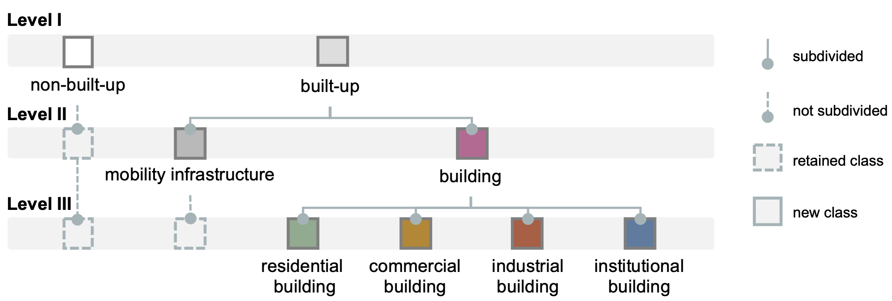
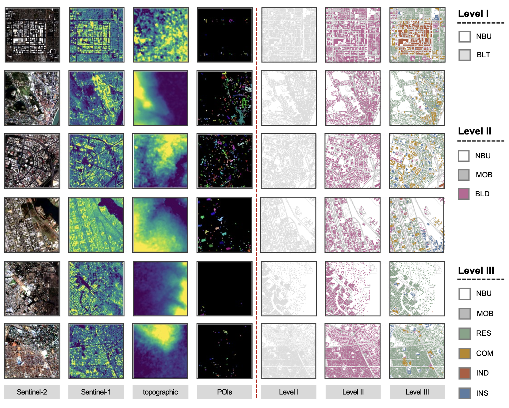

# GlobalBuildingFunctionMapper

>**A Hierarchical Framework for Global Building Function Mapping**

## Overview

Building function information is essential for urban planning and governance,
yet fine-grained functional references remain severely incomplete at the global
scale. This work presents:

- **Global Building Function (GBF) dataset** — a multilevel dataset constructed
  from Sentinel-1/2 imagery, topographic data, and OpenStreetMap POIs
- **A deep learning framework** incorporating a hierarchy-consistent loss (HCL)
  to enforce structured supervision across label levels, and a harmonized
  pseudo-labeling strategy (HPL) to mitigate label sparsity.
    
## Dataset

The GBF dataset contains **38,528 image patches** (256 × 256 pixels) across
six continents, each comprising multimodal physical observations, POI features,
and hierarchical labels at three semantic levels.

### Hierarchical label system

Labels follow a three-level nested taxonomy. Level I distinguishes
*built-up* (BLT) from *non-built-up* (NBU) areas. Level II subdivides
built-up areas into *building* (BLD) and *mobility infrastructure* (MOB).
Level III further categorizes buildings into four functional types:
*residential* (RES), *commercial* (COM), *industrial* (IND), and
*institutional* (INS). Terminal classes that are not subdivided are
carried forward unchanged to finer levels.

    

### Representative samples

Each row below corresponds to a different continent. The left four columns
show the multimodal inputs (Sentinel-2, Sentinel-1, topographic layers,
and POIs); the right three columns show the corresponding labels from
Level I to Level III. Note how label completeness decreases at finer
levels — directly reflecting the structured sparsity our framework is
designed to exploit.

    

## Repository Structure

    GlobalBuildingFunctionMapper/
    ├── README.md
    ├── LICENSE
    ├── figures/
    ├── dataset/        # Dataset download links & documentation
    ├── model/          # Pretrained model weights
    └── code/           # Training, inference, and evaluation scripts

